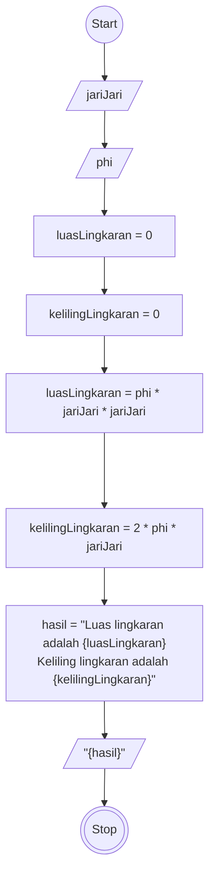

# JavaScript1

## Menghitung Luas dan Keliling Lingkaran

```mermaid
flowchart TD
A@{ shape: circle, label: Start }
B@{ shape: lean-r, label: jariJari}
C@{ shape: lean-r, label: phi }
D@{ shape: rect, label: "luasLingkaran = 0" }
E@{ shape: rect, label: "kelilingLingkaran = 0" }
F@{ shape: rect, label: "luasLingkaran = phi * jariJari * jariJari" }
G@{ shape: rect, label: "kelilingLingkaran = 2 * phi * jariJari" }

H@{ shape: rect, label: 'hasil = "Luas lingkaran adalah {luasLingkaran}

Keliling lingkaran adalah {kelilingLingkaran}"' }

I@{ shape: lean-r, label: '"{hasil}"' }
J@{ shape: dbl-circ, label: Stop }


A --> B --> C --> D --> E --> F ---> G --> H --> I --> J

```